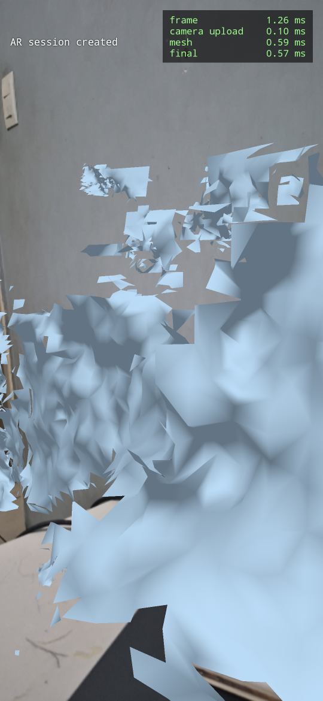
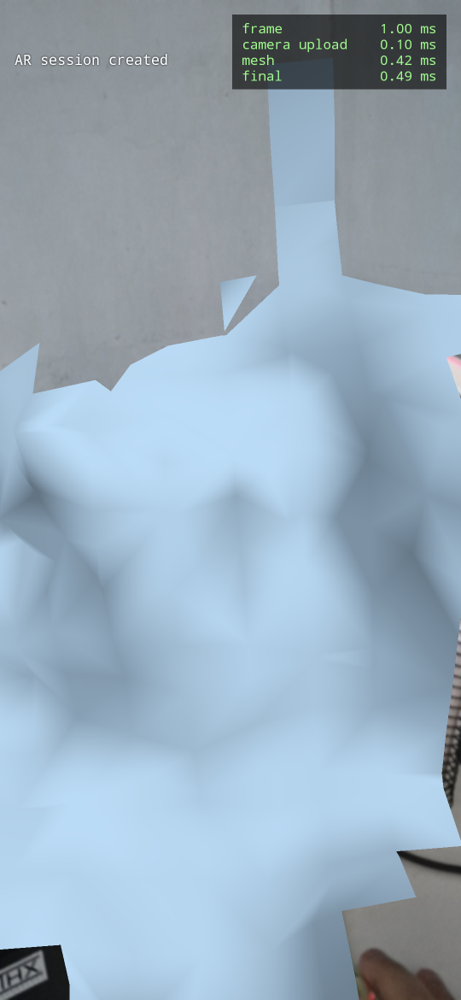
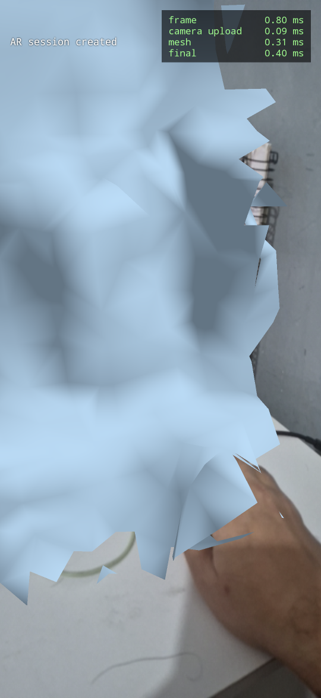
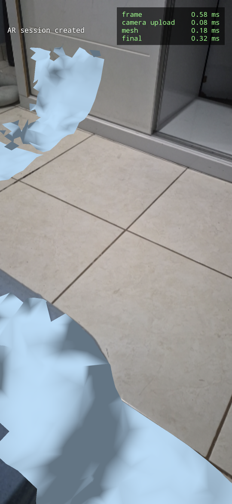
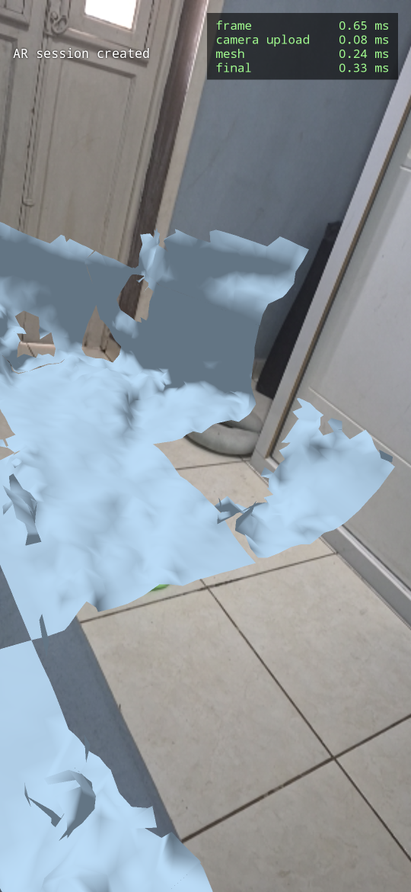
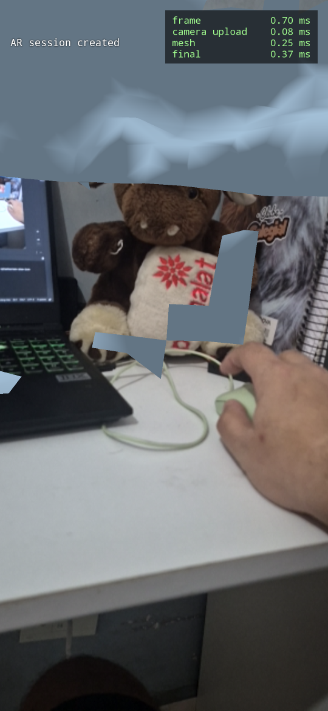
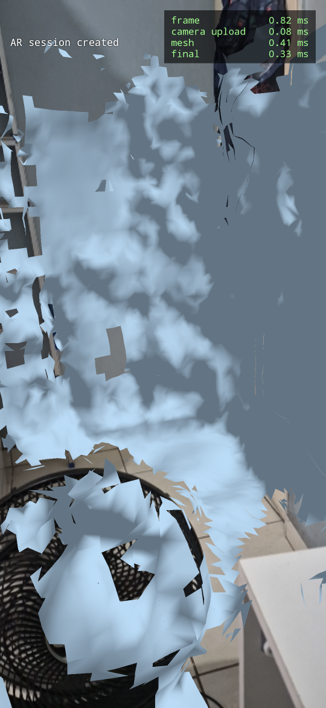
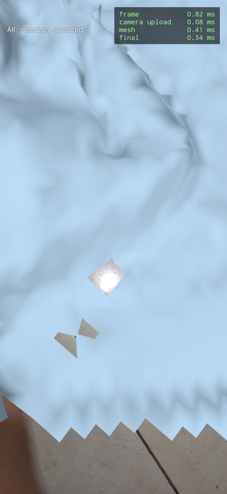

# What Fixed the Reconstruction, and What Only Looked Like It Would

A record of one day of work on `putorana::recon`, written down because most of it
was wrong and the wrong parts are the expensive ones to rediscover.

The reconstruction went from 8.7 fps and a wall of lumps to 30 fps and a surface
that covers a floor, a bed, a fan and a doorway. Four things were changed to get
there. Only one of them was the actual problem, and it was not any of the three
that theory pointed at.

The screenshots are the evidence. They are in this directory, timestamped, and
each section names the one that belongs to it.

---

# Where this starts

The previous session ended with a working pipeline and a bad picture. Raw depth
was being integrated, chunks were being meshed and drawn, and the result looked
like this:



Three complaints, in the words they were made in: the mesh has gaps between
chunks, there is noise that never goes away, and distant things reconstruct
badly. The frame loop was running at 8.7 fps with the GPU finishing in 1.26 ms,
so roughly 114 ms per frame was CPU time that nothing was measuring.

There was also a standing failure from the day before. Four changes had been made
at once (mesh capacity, weight cap, space carving, quadratic truncation) and the
result was worse than what it replaced. It was reverted wholesale because there
was no way to tell which of the four had done the damage. That reversion is why
everything below moves one variable at a time.

---

# The method

Stated up front because it is the part worth keeping.

**One change per measurement.** Not because it is tidy, but because the four
change experiment produced a regression that could not be attributed and
therefore could not be learned from. The cost of that afternoon was the whole
afternoon.

**Instrument before tuning.** The 114 ms was known to be CPU and assumed to be in
integration. Assumed is the word that mattered: the far plane was about to be cut
on the strength of that assumption, and if the assumption had been wrong the
change would have quietly done nothing while looking like it had been tried.

**Say what each outcome would mean before looking at the number.** This is the
one that actually caught an error. Before running the depth budget probe, both
possible results were written down along with what each would imply. The result
came back on the side that contradicted the hypothesis, and there was no room
left to reinterpret it favourably.

---

# Round one: the confidence gate

## The reasoning

Raw depth on ARCore is motion stereo. It matches image patches between successive
frames and turns disparity into distance. That works wherever the picture has
texture to match. On a plainly painted wall there is nothing to match, the
matching cost is flat across the entire disparity search, and the minimum gets
chosen by sensor noise and compression artefacts rather than by geometry.

A TSDF does not rescue this. Averaging removes error only when successive errors
are independent. A flat patch seen twice from nearby viewpoints produces the
*same* bad match, so fusing a hundred frames converges on the artefact instead of
cancelling it.

That argument was already written in `ar/Subsystem.cpp` as the justification for
choosing raw depth over the smoothed stream. It cuts both ways, and only one
direction had been applied. The smoothed stream was rejected for producing
correlated errors; raw depth on a featureless wall produces correlated errors of
its own.

ARCore has the answer for this and we were not reading it. From
`arcore_c_api.h:5262`:

> If an application requires filtering out low-confidence pixels, removing depth
> pixels below a confidence threshold of half confidence (128) tends to work
> well.

`ArFrame_acquireRawDepthConfidenceImage` gives an 8-bit map, same dimensions as
the depth map, 0 for no confidence and 255 for high. Raw depth without it is half
of an API.

## What was built

`ar::DepthImage` gained `confidence` and `confidenceRowStrideBytes`. The
acquisition sits next to the depth acquisition, is released next to it, and
survives a failure of either one independently. A missing confidence map is
treated as *no opinion* rather than *no confidence*, so a device that refuses to
produce one still reconstructs, unfiltered, exactly as before.

The gate was placed **before** `observedMax` is updated, and that ordering is
load bearing. `Chisel::IntegrateDepthScan` builds its frustum from the furthest
surviving sample, so a 13 metre reading in a one metre room inflates the chunk
count cubically. Those readings are precisely the near-zero confidence ones.
Letting them set the far plane and only then discarding their depth would pay the
entire cost of the outlier and collect none of its geometry.

Gating also made a new failure mode reachable. `DepthImage::GetStats` skips NaN,
so on an all-NaN frame it returns its initial values of `FLT_MAX` and `-FLT_MAX`
and hands those to `SetNearPlane` and `SetFarPlane`. The bounding box of that
frustum spans two saturated integers and `GetChunkIDsIntersecting` loops between
them. Rare before the gate, ordinary after it (a dark room, a phone on a desk,
the first seconds after a resume), so `Integrate` now returns early when nothing
survived.

## What happened

FPS was solved outright. The frame loop went to a stable 30.0 fps, which is the
camera rate, with integration at 11.8 ms instead of 114 ms and 62 voxel chunks
instead of 592.

The picture got worse in a specific way:



The user's verdict was that the meshes were much more faithful to the real world
at the cost of holes and much less coverage, and that a floor came back as small
disconnected patches rather than a continuous surface. "Isso não me serve."

The log agreed. The gate at 128 was rejecting 79% of the samples in a frame.

## Why lowering the threshold was the wrong response

The obvious next move is 128 to 90, then 64, then 48. It does not work, and the
reason is structural rather than numerical.

A floor is exactly the low-texture surface that the confidence map is most
pessimistic about. Any threshold high enough to suppress the bad geometry also
deletes the good geometry in the same regions. The threshold was not badly
chosen. The instrument was wrong for the job.

---

# Round two: weight instead of gate

## The change

A TSDF fuses by weighted average. A poor sample does not have to be discarded; it
can be admitted with a small weight, so it builds a continuous surface where
nothing better exists and is outvoted wherever something better arrives.

Doing that required touching a line that turned out to be a standing bug.
`ProjectionIntegrator::Integrate`, the depth path this app actually calls, passed
a hardcoded weight:

```cpp
voxel.Integrate(surfaceDist, 1.0f);
```

The `weighter` member is consulted only by `IntegrateColor`, which this app never
calls. So `Config::weight` and `SetWeighter` had been dead code in the live path
since the library was vendored. Numerically it changed nothing at the time,
because with constant truncation the weighter returns a constant anyway, but the
configuration was lying about what it controlled.

The fork now takes an optional per-pixel weight image, indexed at the same pixel
the depth was read from, so it costs one array read and no additional projection.
Confidence 32 to 255 maps linearly onto weight 0.05 to 1.00. The threshold
dropped from 128 to 32 and its job changed: it is now an outlier filter whose
only remaining purpose is keeping absurd readings out of the frustum, which is
the one thing a weight cannot do.

## What happened

Close range became very good:



The floor did not:





The user's description was that some areas capture well, others capture badly,
and there was no way to tell why. That last part is the useful observation, and
it deserved more attention than it got at the time.

## Two explanations that were ruled out by looking

Distance was ruled out by the doorway screenshot. The nearest and most central
floor tile has no mesh while the floor around the door, further away, is covered.

Grazing incidence was ruled out by the same image plus the tiled floor one. The
bottom left and bottom right of the frame are the same distance and the same
inclination, and one has a mesh while the other does not.

What the covered regions had in common was texture: grout lines, skirting,
door frames, furniture edges. What was missing was the clean face of a tile. That
produced a hypothesis, and the hypothesis was wrong.

---

# The measurement that killed the hypothesis

The claim was that untextured surfaces produce no depth at all, not bad depth.
Motion stereo with nothing to match returns zero, which becomes NaN, and no
weighting scheme reaches an absent measurement.

Two counters were added: how many samples arrive with no estimate, and a
histogram of the confidences of the samples that do exist. Before running it,
both outcomes were written down:

* If *no estimate* comes back above 50% with the histogram piled at the top, the
  tile faces produce nothing and there is no lever in the integrator at all.
* If *no estimate* is low and the histogram is piled at the bottom, the depth
  exists and is poor, and the weight curve is the lever.

The device answered:

```
RECONPROBE depth budget over the window: 14% of samples had NO estimate at all
RECONPROBE confidence of the samples that DID exist, 32 wide: 40% 3% 3% 4% 4% 6% 4% 34%
```

**6% to 25% across the whole session.** Not above 50%. The tile faces have
depth. The texture hypothesis was wrong as stated, and there was no reading of
that number that rescued it.

What the probe did find was worth having. The confidence distribution is
**bimodal**: roughly 40% in the bottom bucket, roughly 34% in the top bucket, and
the six middle buckets holding 3% to 6% each. ARCore is close to binary about
whether it knows a distance. The linear weight ramp from 0.05 to 1.00 spends
almost its entire range on a region that holds a quarter of the samples, which
means it does far less work than its design suggested. In practice it behaves as
a gate at 32 with the confident samples weighted near 1.

---

# The bug that was actually there

With the hypothesis dead, the log got read again rather than the picture. This
line had been printing for half an hour:

```
135 chunks held, 129 awaiting remesh
135 chunks held, 129 awaiting remesh
135 chunks held, 129 awaiting remesh
```

Pinned at 129 for over thirty seconds. The remesh budget is 8 chunks per frame at
30 fps, which is 240 chunks per second. A backlog of 129 should clear in half a
second. It never cleared.

And the user had just reported something that fitted:



The mesh covers the region above and stops dead along a straight edge. Everything
below that line is absent, as though the chunk containing it had never been
generated.

## The cause

`Reconstruction::Remesh` walked Chisel's dirty set from `begin()` every frame,
took the first `maxChunks` entries and erased them:

```cpp
for (auto it = pending.begin(); it != pending.end() && done < maxChunks;) {
    const chisel::ChunkID id = it->first;
    it = pending.erase(it);
    ...
}
```

`ChunkSet` is `std::unordered_map<ChunkID, bool, ChunkHasher>`. `begin()` is the
first non-empty **hash bucket**, which is a fixed and arbitrary function of the
chunk coordinates. Meanwhile integration re-marks the 3x3x3 neighbourhood of
every chunk it touches, so with the camera held reasonably still the same set is
re-inserted every frame into the same buckets.

The loop therefore drained the same low-bucket chunks over and over and never
reached the high-bucket ones. **The budget was never the constraint. The ordering
was.**

This accounts for all three symptoms at once:

* Coverage that varies by region with no geometric pattern, because the selection
  criterion was hash order and hash order has no relationship to space.
* An object cut along a chunk boundary, because that is literally what a chunk
  that never got its turn looks like.
* No improvement over time, because the starving set is the same set every frame.

## The fix

A cycle. Take everything pending into a queue, drain the queue at the budget over
as many frames as it takes, and refill only when it is empty. Chunks dirtied
mid-cycle collect in Chisel's set and are picked up at the next refill. Every
dirty chunk is now meshed within one cycle, which is `queueSize / budget` frames,
around half a second at the numbers above.

`pendingRemeshCount()` reports both halves, since reporting only Chisel's set
would read as zero at the moment a full cycle has just been taken out of it.

---

# Where it landed

The backlog now moves. It drains to 8 and refills toward 116 instead of sitting
at 129.





| | Start of day | End of day |
|---|---|---|
| frame loop | 8.7 fps | 30.0 fps (camera rate) |
| integrate | ~114 ms | 19 ms at 111 chunks |
| voxel chunks in view | 592 | 111 |
| dedup ratio | 3.19x | 4.69x |
| mesh memory | 17 MiB / 263 nodes | 4 MiB / 64 nodes |

Chunk mesh capacity was checked along the way and never came close to binding:
`203 0 0 0 0 0 0 0` in buckets of 512, with zero of 204 remeshes exceeding the
1024 vertex limit. Worth stating because it was blamed twice.

The GPU was never the problem and still is not. It finishes a frame in 0.82 ms.

---

# What is still wrong

Three kinds of artefact remain, with different causes, and they are worth telling
apart before anyone tries to fix them together.

**The sawtooth boundary.** Visible along the bottom edge of the floor
screenshot. This is not noise. Marching cubes refuses to mesh the outer voxel
layer of a chunk until `allNeighborsObserved`, so the frontier of what has been
seen always arrives as a zigzag. It resolves itself as the sweep continues.

**Isolated floating fragments.** Triangles hanging in mid air with nothing
around them. These are voxels that formed a zero crossing on very few
observations. This is space carving and weight cap territory, covered below.

**Surface undulation.** The genuine remaining noise, and the one with a
measurement pointing at it. The bimodal confidence distribution means a weight
curve that separates the two modes should be worth more than any truncation
tuning.

## Space carving is broken, and it is a bug rather than a setting

`DistVoxel::Carve()` reads:

```cpp
inline void Carve()
{
    Integrate(0.0, 1.5);
}
```

It pushes the SDF toward zero with weight 1.5, and `Integrate` **increases** the
accumulated weight. A voxel with weight 200 moves by 1.5/201.5, under one
percent, and comes out heavier than it went in. Every carving attempt makes the
next one weaker.

This is why the plush ox did not erode when it was taken away the previous day.
Carving as written is asymptotically self-defeating. The fix is for `Carve` to
decay the weight rather than out-vote it, which then also allows a generous
weight cap without losing the ability to remove things.

The second half of the same branch has its own problem:

```cpp
else if (enableVoxelCarving && surfaceDist > truncation + carvingDist)
{
    if (voxel.GetWeight() > 0 && voxel.GetSDF() < 1e-5)
```

Only voxels whose SDF is already below `1e-5` are eligible. A voxel sitting just
in front of a removed surface has a small positive SDF and never qualifies.

## Truncation does not depend on distance

`truncationQuadratic` and `truncationLinear` are both zero, so tau is a constant
0.06 m at every range. ARCore documents its depth error as growing quadratically
with distance, and dynamic truncation is one of the three things CHISEL
contributes over plain KinectFusion. The quadratic term is currently switched
off. It was part of the four change experiment that got reverted, so it has never
been evaluated on its own.

---

# What not to try again

Written as a list because the cost of rediscovering any of these is a session.

1. **Do not raise the confidence gate toward 128.** Measured at 79% rejection,
   and the surfaces it deletes are the ones a floor is made of. The gate is an
   outlier filter now. Quality lives in the weight.
2. **Do not blame chunk mesh capacity for a memory or coverage problem.** It was
   blamed twice. The overflow counter reads `203 0 0 0 0 0 0 0` with zero
   exceeding 1024. The OOM was `Chunk::AllocateDistVoxels`, and the stack trace
   said so the first time it appeared.
3. **Do not trust `Chisel.h` to respect the configured far plane.**
   `IntegrateDepthScan` calls `GetStats` and builds its frustum from the maximum
   value in the image. A single stray uint16 can claim 65 metres, frustum volume
   goes with the cube of depth, and the process reached 1.1 GB. The clamp in our
   own conversion loop is what keeps this from returning.
4. **Do not tune `parallel_for`.** Its `threshold = 1000` means it spawns no
   threads at all at the sizes this app operates on. The integrator is
   single-threaded today whether or not anyone intended that.
5. **Do not measure a capacity under one truncation and then change the
   truncation.** That happened, and it is how the 1024 vertex capacity came to be
   exceeded by 51 chunks out of 204 in the four change experiment.

---

# Why this matters for what comes next

The surface is now good enough that the remaining noise can be attacked **on the
mesh** rather than in the field. Decimation or smoothing over chunk meshes is a
pure, wide, fixed-output-size operation, which is the shape a compute shader
wants. `recon/README.md` already identifies marching cubes over dirty chunks as
the first good candidate for migration off the CPU, and a smoothing pass sits
directly beside it in the same pipeline stage.

That option did not exist this morning. A smoothing pass over a mesh with holes
in it, and with entire chunks missing for reasons nobody had diagnosed, would
have smoothed the wrong thing and hidden the starvation bug behind a nicer
looking surface.
